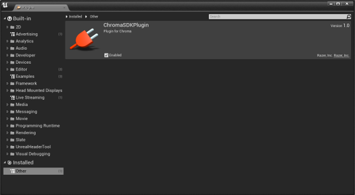
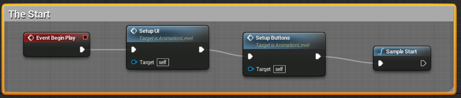
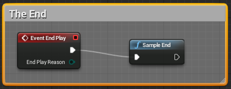
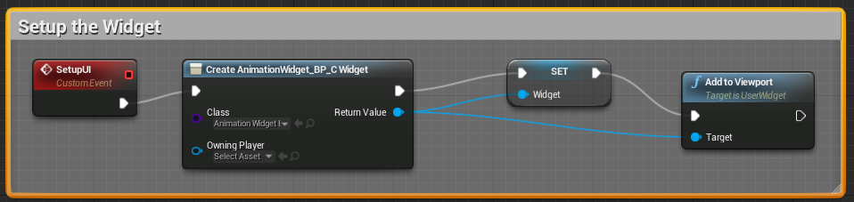
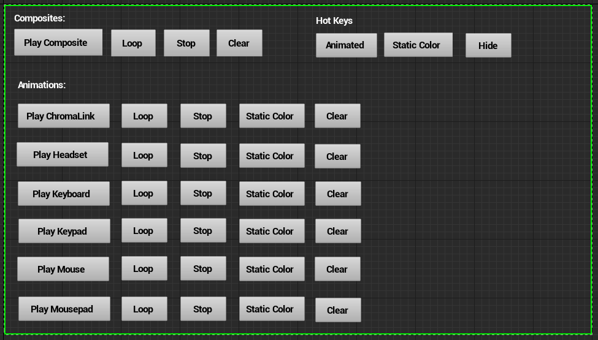
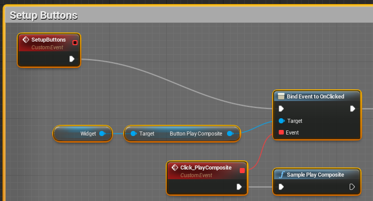

* Note: Visit the [Chroma Animation Guide](https://chroma.razer.com/ChromaGuide/) to find the latest supported plugin for Chroma RGB.

* Note: This is the current Chroma SDK supported plugin for UE4.

## Table of contents

* [See Also](#see-also)
* [Quick Start](#quick-start)
* [Overview](#overview)
* [Tutorials](#tutorials)
* [Supported versions](#supported-versions)
* [Dependencies](#dependencies)
* [Plugin Structure](#plugin-structure)
* [Samples](#samples)
* [API](#api)

## See Also

**Docs:**

- [Chroma Animation Guide](http://chroma.razer.com/ChromaGuide/) - Visual examples of the Chroma Animation API methods

**Plugins:**

- [CChromaEditor](https://github.com/RazerOfficial/CChromaEditor) - C++ native MFC library for playing and editing Chroma animations

- [UE4_XDK_SampleApp](https://github.com/razerofficial/UE4_XDK_SampleApp) - UE4 Chroma samples and runtime module with Blueprint library for the ChromaSDK


## Quick Start ##

* Install [Synapse](https://www.razer.com/synapse-3)

* Make sure the Chroma Connect module is installed.


* If you don't have Chroma hardware, you can see Chroma effects with the [Chroma Emulator](https://github.com/razerofficial/ChromaEmulator)


## Overview

`UE4ChromaSDKRT` provides a runtime module for using the `ChromaSDK`. The runtime module provides a blueprint library and C++ methods for playing Chroma animations. See the [Chroma Guide](http://chroma.razer.com/ChromaGuide/) for details on how to make visually interesting Chroma animations using the plugin API.

## Tutorials


### Videos


**Chroma Design Guide**

<a target="_blank" href="https://www.youtube.com/watch?v=-demSB_xLTc"></a>

**UE4ChromaSDKRT Plugin Setup** for your specific version of UE4.

<a target="_blank" href="https://www.youtube.com/watch?v=7buO9YCXjtY"></a>

**UE4ChromaSDKRT Overview**

<a target="_blank" href="https://www.youtube.com/watch?v=-Q6Dn15m1Jg"></a>

**Simplify UI Blueprints**

<a target="_blank" href="https://www.youtube.com/watch?v=Rz-mOXvd2a0"></a>

## Supported versions

This project is checked in with engine 4.21 and supports later versions. The scripts at [UE4ChromaSDKRT_Versions](https://github.com/razerofficial/UE4ChromaSDKRT_Versions) can convert to earlier versions.

## Plugin Structure

```
UE4ChromaSDKRT/Plugins/
UE4ChromaSDKRT/Plugins/ChromaSDKPlugin/ChromaSDKPlugin.uplugin
UE4ChromaSDKRT/Plugins/ChromaSDKPlugin/Resources
UE4ChromaSDKRT/Plugins/ChromaSDKPlugin/Resources/Icon128.png
UE4ChromaSDKRT/Plugins/ChromaSDKPlugin/Source/ChromaSDKPlugin
UE4ChromaSDKRT/Plugins/ChromaSDKPlugin/Source/ChromaSDKPlugin/ChromaSDKPlugin.Build.cs
UE4ChromaSDKRT/Plugins/ChromaSDKPlugin/Source/ChromaSDKPlugin/Private
UE4ChromaSDKRT/Plugins/ChromaSDKPlugin/Source/ChromaSDKPlugin/Private/Animation1D.cpp
UE4ChromaSDKRT/Plugins/ChromaSDKPlugin/Source/ChromaSDKPlugin/Private/Animation2D.cpp
UE4ChromaSDKRT/Plugins/ChromaSDKPlugin/Source/ChromaSDKPlugin/Private/AnimationBase.cpp
UE4ChromaSDKRT/Plugins/ChromaSDKPlugin/Source/ChromaSDKPlugin/Private/ChromaSDKPlugin.cpp
UE4ChromaSDKRT/Plugins/ChromaSDKPlugin/Source/ChromaSDKPlugin/Private/UE4ChromaSDKRT/ChromaSDKPluginAnimation1DObject.cpp
UE4ChromaSDKRT/Plugins/ChromaSDKPlugin/Source/ChromaSDKPlugin/Private/UE4ChromaSDKRT/ChromaSDKPluginAnimation2DObject.cpp
UE4ChromaSDKRT/Plugins/ChromaSDKPlugin/Source/ChromaSDKPlugin/Private/ChromaSDKPluginBPLibrary.cpp
UE4ChromaSDKRT/Plugins/ChromaSDKPlugin/Source/ChromaSDKPlugin/Private/ChromaSDKPluginPrivatePCH.h
UE4ChromaSDKRT/Plugins/ChromaSDKPlugin/Source/ChromaSDKPlugin/Private/ChromaSDKPluginTypes.cpp
UE4ChromaSDKRT/Plugins/ChromaSDKPlugin/Source/ChromaSDKPlugin/Private/ChromaThread.cpp
UE4ChromaSDKRT/Plugins/ChromaSDKPlugin/Source/ChromaSDKPlugin/Public
UE4ChromaSDKRT/Plugins/ChromaSDKPlugin/Source/ChromaSDKPlugin/Public/Animation1D.h
UE4ChromaSDKRT/Plugins/ChromaSDKPlugin/Source/ChromaSDKPlugin/Public/Animation2D.h
UE4ChromaSDKRT/Plugins/ChromaSDKPlugin/Source/ChromaSDKPlugin/Public/AnimationBase.h
UE4ChromaSDKRT/Plugins/ChromaSDKPlugin/Source/ChromaSDKPlugin/Public/ChromaSDKPluginAnimation1DObject.h
UE4ChromaSDKRT/Plugins/ChromaSDKPlugin/Source/ChromaSDKPlugin/Public/ChromaSDKPluginAnimation2DObject.h
UE4ChromaSDKRT/Plugins/ChromaSDKPlugin/Source/ChromaSDKPlugin/Public/ChromaSDKPluginBPLibrary.h
UE4ChromaSDKRT/Plugins/ChromaSDKPlugin/Source/ChromaSDKPlugin/Public/ChromaSDKPluginTypes.h
UE4ChromaSDKRT/Plugins/ChromaSDKPlugin/Source/ChromaSDKPlugin/Public/ChromaThread.h
UE4ChromaSDKRT/Plugins/ChromaSDKPlugin/Source/ChromaSDKPlugin/Public/IChromaSDKPlugin.h
UE4ChromaSDKRT/Plugins/ChromaSDKPlugin/Source/ChromaSDKPlugin/Public/RzChromaSDKDefines.h
UE4ChromaSDKRT/Plugins/ChromaSDKPlugin/Source/ChromaSDKPlugin/Public/RzChromaSDKTypes.h
UE4ChromaSDKRT/Plugins/ChromaSDKPlugin/Source/ChromaSDKPlugin/Public/RzErrors.h
```

## Plugin appears in Window->Plugins



## Samples

**Animation Sample**

* The animation sample showcases invoking the ChromaSDK `Blueprint Library` from the C++ [Sample BP Library](Source/UE4ChromaSDKRT/SampleBPLibrary.cpp).


* Event `BeginPlay` invokes the setup for UI and buttons, and finishes invoking the `SampleStart` BP function.



* Event `EndPlay` ends the application by invoking the `SampleEnd` BP function.



* The `SetupUI` custom event loads the sample BP Widget and adds the stored widget var to the viewport.



* The `AnimationWidget_BP` UI Widget defines the all the button variable names.



* The `SetupButtons` custom event manually uses the `Widget` variable to add a click handler for each UI Widget button accessor which invokes the corresponding BP sample function.



* The animation sample `Chroma` files are found in the project's content folder. There's a set of `Blank`, `Fire`, and `Random` Chroma animation files. After building the Windows standalone application, the `Chroma` files should be copied to the compiled application content folder.

## API

`UE4ChromaSDKRT` is a Blueprint API library with more methods than the older [UE4ChromaSDK](https://github.com/RazerOfficial/UE4ChromaSDK#api) Blueprint library with some exceptions to be compatible with earlier versions of UE4.

* Take a look at the code from [SampleAppChromaBP.cpp](https://github.com/razerofficial/UE4_XDK_SampleApp/blob/master/UE4ChromaSDKRT/Source/UE4ChromaSDKRT/SampleAppChromaBP.cpp). These sample effects show how the blueprint library was used to create the `Chroma` effects that correspond to the `Guide`.

* Enum syntax - Enums are namespaced and types use the `EChromaSDKKeyboardKey::Type` syntax to avoid collisions.

* No const enum types or passing enums by reference in function parameters - Avoid use of const enum types because that seems to crash in UE 4.5.

* [AddNonZeroAllKeysAllFrames](#AddNonZeroAllKeysAllFrames)
* [AddNonZeroAllKeysAllFramesName](#AddNonZeroAllKeysAllFramesName)
* [AddNonZeroAllKeysAllFramesOffset](#AddNonZeroAllKeysAllFramesOffset)
* [AddNonZeroAllKeysAllFramesOffsetName](#AddNonZeroAllKeysAllFramesOffsetName)
* [AddNonZeroTargetAllKeysAllFrames](#AddNonZeroTargetAllKeysAllFrames)
* [AddNonZeroTargetAllKeysAllFramesName](#AddNonZeroTargetAllKeysAllFramesName)
* [AddNonZeroTargetAllKeysAllFramesOffset](#AddNonZeroTargetAllKeysAllFramesOffset)
* [AddNonZeroTargetAllKeysAllFramesOffsetName](#AddNonZeroTargetAllKeysAllFramesOffsetName)
* [AppendAllFrames](#AppendAllFrames)
* [AppendAllFramesName](#AppendAllFramesName)
* [ClearAll](#ClearAll)
* [ClearAnimationType](#ClearAnimationType)
* [CloseAll](#CloseAll)
* [CloseAnimation](#CloseAnimation)
* [CloseAnimationName](#CloseAnimationName)
* [CopyAnimation](#CopyAnimation)
* [CopyAnimationName](#CopyAnimationName)
* [CopyKeyColor](#CopyKeyColor)
* [CopyKeyColorName](#CopyKeyColorName)
* [CopyKeysColor](#CopyKeysColor)
* [CopyKeysColorName](#CopyKeysColorName)
* [CopyNonZeroAllKeys](#CopyNonZeroAllKeys)
* [CopyNonZeroAllKeysAllFrames](#CopyNonZeroAllKeysAllFrames)
* [CopyNonZeroAllKeysAllFramesName](#CopyNonZeroAllKeysAllFramesName)
* [CopyNonZeroAllKeysAllFramesOffset](#CopyNonZeroAllKeysAllFramesOffset)
* [CopyNonZeroAllKeysAllFramesOffsetName](#CopyNonZeroAllKeysAllFramesOffsetName)
* [CopyNonZeroAllKeysName](#CopyNonZeroAllKeysName)
* [CopyNonZeroAllKeysOffset](#CopyNonZeroAllKeysOffset)
* [CopyNonZeroAllKeysOffsetName](#CopyNonZeroAllKeysOffsetName)
* [CopyNonZeroKeyColor](#CopyNonZeroKeyColor)
* [CopyNonZeroKeyColorName](#CopyNonZeroKeyColorName)
* [CopyNonZeroTargetAllKeys](#CopyNonZeroTargetAllKeys)
* [CopyNonZeroTargetAllKeysAllFrames](#CopyNonZeroTargetAllKeysAllFrames)
* [CopyNonZeroTargetAllKeysAllFramesName](#CopyNonZeroTargetAllKeysAllFramesName)
* [CopyNonZeroTargetAllKeysAllFramesOffset](#CopyNonZeroTargetAllKeysAllFramesOffset)
* [CopyNonZeroTargetAllKeysAllFramesOffsetName](#CopyNonZeroTargetAllKeysAllFramesOffsetName)
* [CopyNonZeroTargetAllKeysName](#CopyNonZeroTargetAllKeysName)
* [CopyZeroTargetAllKeysAllFrames](#CopyZeroTargetAllKeysAllFrames)
* [CopyZeroTargetAllKeysAllFramesName](#CopyZeroTargetAllKeysAllFramesName)
* [DuplicateFirstFrame](#DuplicateFirstFrame)
* [DuplicateFirstFrameName](#DuplicateFirstFrameName)
* [DuplicateFrames](#DuplicateFrames)
* [DuplicateFramesName](#DuplicateFramesName)
* [DuplicateMirrorFrames](#DuplicateMirrorFrames)
* [DuplicateMirrorFramesName](#DuplicateMirrorFramesName)
* [FadeEndFrames](#FadeEndFrames)
* [FadeEndFramesName](#FadeEndFramesName)
* [FadeStartFrames](#FadeStartFrames)
* [FadeStartFramesName](#FadeStartFramesName)
* [FillColor](#FillColor)
* [FillColorAllFrames](#FillColorAllFrames)
* [FillColorAllFramesName](#FillColorAllFramesName)
* [FillColorAllFramesRGB](#FillColorAllFramesRGB)
* [FillColorAllFramesRGBName](#FillColorAllFramesRGBName)
* [FillColorName](#FillColorName)
* [FillColorRGB](#FillColorRGB)
* [FillColorRGBName](#FillColorRGBName)
* [FillNonZeroColor](#FillNonZeroColor)
* [FillNonZeroColorAllFrames](#FillNonZeroColorAllFrames)
* [FillNonZeroColorAllFramesName](#FillNonZeroColorAllFramesName)
* [FillNonZeroColorAllFramesRGB](#FillNonZeroColorAllFramesRGB)
* [FillNonZeroColorAllFramesRGBName](#FillNonZeroColorAllFramesRGBName)
* [FillNonZeroColorName](#FillNonZeroColorName)
* [FillNonZeroColorRGB](#FillNonZeroColorRGB)
* [FillNonZeroColorRGBName](#FillNonZeroColorRGBName)
* [FillRandomColors](#FillRandomColors)
* [FillRandomColorsAllFrames](#FillRandomColorsAllFrames)
* [FillRandomColorsAllFramesName](#FillRandomColorsAllFramesName)
* [FillRandomColorsBlackAndWhite](#FillRandomColorsBlackAndWhite)
* [FillRandomColorsBlackAndWhiteAllFrames](#FillRandomColorsBlackAndWhiteAllFrames)
* [FillRandomColorsBlackAndWhiteAllFramesName](#FillRandomColorsBlackAndWhiteAllFramesName)
* [FillRandomColorsBlackAndWhiteName](#FillRandomColorsBlackAndWhiteName)
* [FillRandomColorsName](#FillRandomColorsName)
* [FillThresholdColorsAllFrames](#FillThresholdColorsAllFrames)
* [FillThresholdColorsAllFramesName](#FillThresholdColorsAllFramesName)
* [FillThresholdColorsAllFramesRGB](#FillThresholdColorsAllFramesRGB)
* [FillThresholdColorsAllFramesRGBName](#FillThresholdColorsAllFramesRGBName)
* [FillThresholdColorsMinMaxAllFramesRGB](#FillThresholdColorsMinMaxAllFramesRGB)
* [FillThresholdColorsMinMaxAllFramesRGBName](#FillThresholdColorsMinMaxAllFramesRGBName)
* [FillThresholdColorsRGB](#FillThresholdColorsRGB)
* [FillThresholdColorsRGBName](#FillThresholdColorsRGBName)
* [FillThresholdRGBColorsAllFramesRGB](#FillThresholdRGBColorsAllFramesRGB)
* [FillThresholdRGBColorsAllFramesRGBName](#FillThresholdRGBColorsAllFramesRGBName)
* [FillZeroColor](#FillZeroColor)
* [FillZeroColorAllFrames](#FillZeroColorAllFrames)
* [FillZeroColorAllFramesName](#FillZeroColorAllFramesName)
* [FillZeroColorAllFramesRGB](#FillZeroColorAllFramesRGB)
* [FillZeroColorAllFramesRGBName](#FillZeroColorAllFramesRGBName)
* [FillZeroColorName](#FillZeroColorName)
* [FillZeroColorRGB](#FillZeroColorRGB)
* [FillZeroColorRGBName](#FillZeroColorRGBName)
* [GetAnimation](#GetAnimation)
* [GetAnimationCount](#GetAnimationCount)
* [GetAnimationId](#GetAnimationId)
* [GetAnimationName](#GetAnimationName)
* [GetFrameCount](#GetFrameCount)
* [GetFrameCountName](#GetFrameCountName)
* [GetKeyColor](#GetKeyColor)
* [GetKeyColorName](#GetKeyColorName)
* [GetMaxColumn](#GetMaxColumn)
* [GetMaxLeds](#GetMaxLeds)
* [GetMaxRow](#GetMaxRow)
* [GetPlayingAnimationCount](#GetPlayingAnimationCount)
* [GetPlayingAnimationId](#GetPlayingAnimationId)
* [GetRGB](#GetRGB)
* [InsertDelay](#InsertDelay)
* [InsertDelayName](#InsertDelayName)
* [InsertFrame](#InsertFrame)
* [InsertFrameName](#InsertFrameName)
* [InvertColorsAllFrames](#InvertColorsAllFrames)
* [InvertColorsAllFramesName](#InvertColorsAllFramesName)
* [IsInitialized](#IsInitialized)
* [Lerp](#Lerp)
* [LerpColor](#LerpColor)
* [LoadAnimation](#LoadAnimation)
* [LoadAnimationName](#LoadAnimationName)
* [MakeBlankFrames](#MakeBlankFrames)
* [MakeBlankFramesName](#MakeBlankFramesName)
* [MakeBlankFramesRandom](#MakeBlankFramesRandom)
* [MakeBlankFramesRandomBlackAndWhite](#MakeBlankFramesRandomBlackAndWhite)
* [MakeBlankFramesRandomBlackAndWhiteName](#MakeBlankFramesRandomBlackAndWhiteName)
* [MakeBlankFramesRandomName](#MakeBlankFramesRandomName)
* [MakeBlankFramesRGB](#MakeBlankFramesRGB)
* [MakeBlankFramesRGBName](#MakeBlankFramesRGBName)
* [MultiplyColorLerpAllFrames](#MultiplyColorLerpAllFrames)
* [MultiplyColorLerpAllFramesName](#MultiplyColorLerpAllFramesName)
* [MultiplyIntensity](#MultiplyIntensity)
* [MultiplyIntensityAllFrames](#MultiplyIntensityAllFrames)
* [MultiplyIntensityAllFramesName](#MultiplyIntensityAllFramesName)
* [MultiplyIntensityAllFramesRGB](#MultiplyIntensityAllFramesRGB)
* [MultiplyIntensityAllFramesRGBName](#MultiplyIntensityAllFramesRGBName)
* [MultiplyIntensityColor](#MultiplyIntensityColor)
* [MultiplyIntensityColorAllFrames](#MultiplyIntensityColorAllFrames)
* [MultiplyIntensityColorAllFramesName](#MultiplyIntensityColorAllFramesName)
* [MultiplyIntensityColorName](#MultiplyIntensityColorName)
* [MultiplyIntensityName](#MultiplyIntensityName)
* [MultiplyIntensityRGB](#MultiplyIntensityRGB)
* [MultiplyIntensityRGBName](#MultiplyIntensityRGBName)
* [MultiplyNonZeroTargetColorLerpAllFrames](#MultiplyNonZeroTargetColorLerpAllFrames)
* [MultiplyNonZeroTargetColorLerpAllFramesName](#MultiplyNonZeroTargetColorLerpAllFramesName)
* [MultiplyTargetColorLerpAllFrames](#MultiplyTargetColorLerpAllFrames)
* [MultiplyTargetColorLerpAllFramesName](#MultiplyTargetColorLerpAllFramesName)
* [OffsetColors](#OffsetColors)
* [OffsetColorsAllFrames](#OffsetColorsAllFrames)
* [OffsetColorsAllFramesName](#OffsetColorsAllFramesName)
* [OffsetColorsName](#OffsetColorsName)
* [OffsetNonZeroColors](#OffsetNonZeroColors)
* [OffsetNonZeroColorsAllFrames](#OffsetNonZeroColorsAllFrames)
* [OffsetNonZeroColorsAllFramesName](#OffsetNonZeroColorsAllFramesName)
* [OffsetNonZeroColorsName](#OffsetNonZeroColorsName)
* [OverrideFrameDurationName](#OverrideFrameDurationName)
* [PlayAnimation](#PlayAnimation)
* [PlayAnimationName](#PlayAnimationName)
* [PreviewFrame](#PreviewFrame)
* [PreviewFrameName](#PreviewFrameName)
* [ReduceFrames](#ReduceFrames)
* [ReduceFramesName](#ReduceFramesName)
* [ReverseAllFrames](#ReverseAllFrames)
* [ReverseAllFramesName](#ReverseAllFramesName)
* [SetChromaCustomColorAllFramesName](#SetChromaCustomColorAllFramesName)
* [SetChromaCustomFlagName](#SetChromaCustomFlagName)
* [SetIdleAnimationName](#SetIdleAnimationName)
* [SetKeyColor](#SetKeyColor)
* [SetKeyColorAllFrames](#SetKeyColorAllFrames)
* [SetKeyColorAllFramesName](#SetKeyColorAllFramesName)
* [SetKeyColorName](#SetKeyColorName)
* [SetKeyNonZeroColor](#SetKeyNonZeroColor)
* [SetKeyNonZeroColorName](#SetKeyNonZeroColorName)
* [SetKeysColor](#SetKeysColor)
* [SetKeysColorAllFrames](#SetKeysColorAllFrames)
* [SetKeysColorAllFramesName](#SetKeysColorAllFramesName)
* [SetKeysColorAllFramesRGB](#SetKeysColorAllFramesRGB)
* [SetKeysColorAllFramesRGBName](#SetKeysColorAllFramesRGBName)
* [SetKeysColorName](#SetKeysColorName)
* [SetKeysColorRGB](#SetKeysColorRGB)
* [SetKeysColorRGBName](#SetKeysColorRGBName)
* [SetKeysNonZeroColor](#SetKeysNonZeroColor)
* [SetKeysNonZeroColorAllFrames](#SetKeysNonZeroColorAllFrames)
* [SetKeysNonZeroColorAllFramesName](#SetKeysNonZeroColorAllFramesName)
* [SetKeysNonZeroColorName](#SetKeysNonZeroColorName)
* [StopAll](#StopAll)
* [StopAnimation](#StopAnimation)
* [StopAnimationType](#StopAnimationType)
* [SubtractNonZeroAllKeysAllFrames](#SubtractNonZeroAllKeysAllFrames)
* [SubtractNonZeroAllKeysAllFramesName](#SubtractNonZeroAllKeysAllFramesName)
* [SubtractNonZeroAllKeysAllFramesOffset](#SubtractNonZeroAllKeysAllFramesOffset)
* [SubtractNonZeroAllKeysAllFramesOffsetName](#SubtractNonZeroAllKeysAllFramesOffsetName)
* [SubtractNonZeroTargetAllKeysAllFrames](#SubtractNonZeroTargetAllKeysAllFrames)
* [SubtractNonZeroTargetAllKeysAllFramesName](#SubtractNonZeroTargetAllKeysAllFramesName)
* [SubtractNonZeroTargetAllKeysAllFramesOffset](#SubtractNonZeroTargetAllKeysAllFramesOffset)
* [SubtractNonZeroTargetAllKeysAllFramesOffsetName](#SubtractNonZeroTargetAllKeysAllFramesOffsetName)
* [TrimEndFrames](#TrimEndFrames)
* [TrimEndFramesName](#TrimEndFramesName)
* [TrimFrame](#TrimFrame)
* [TrimFrameName](#TrimFrameName)
* [TrimStartFrames](#TrimStartFrames)
* [TrimStartFramesName](#TrimStartFramesName)
* [UnloadAnimation](#UnloadAnimation)
* [UnloadAnimationName](#UnloadAnimationName)
* [UseIdleAnimation](#UseIdleAnimation)
* [UsePreloading](#UsePreloading)
* [UsePreloadingName](#UsePreloadingName)

---
<a name="AddNonZeroAllKeysAllFrames"></a>
**AddNonZeroAllKeysAllFrames**

Add source color to target where color is not black for all frames, reference
source and target by id.
```c++
void UChromaSDKPluginBPLibrary::AddNonZeroAllKeysAllFrames(int32 sourceAnimationId,
	int32 targetAnimationId);
```

---
<a name="AddNonZeroAllKeysAllFramesName"></a>
**AddNonZeroAllKeysAllFramesName**

Add source color to target where color is not black for all frames, reference
source and target by name.
```c++
void UChromaSDKPluginBPLibrary::AddNonZeroAllKeysAllFramesName(const FString&
	sourceAnimationName, const FString& targetAnimationName);
```

---
<a name="AddNonZeroAllKeysAllFramesOffset"></a>
**AddNonZeroAllKeysAllFramesOffset**

Add source color to target where color is not black for all frames starting
at offset for the length of the source, reference source and target by
id.
```c++
void UChromaSDKPluginBPLibrary::AddNonZeroAllKeysAllFramesOffset(int32 sourceAnimationId,
	int32 targetAnimationId, int32 offset);
```

---
<a name="AddNonZeroAllKeysAllFramesOffsetName"></a>
**AddNonZeroAllKeysAllFramesOffsetName**

Add source color to target where color is not black for all frames starting
at offset for the length of the source, reference source and target by
name.
```c++
void UChromaSDKPluginBPLibrary::AddNonZeroAllKeysAllFramesOffsetName(const
	FString& sourceAnimationName, const FString& targetAnimationName, int32
	offset);
```

---
<a name="AddNonZeroTargetAllKeysAllFrames"></a>
**AddNonZeroTargetAllKeysAllFrames**

Add source color to target where the target color is not black for all frames,
reference source and target by id.
```c++
void UChromaSDKPluginBPLibrary::AddNonZeroTargetAllKeysAllFrames(int32 sourceAnimationId,
	int32 targetAnimationId);
```

---
<a name="AddNonZeroTargetAllKeysAllFramesName"></a>
**AddNonZeroTargetAllKeysAllFramesName**

Add source color to target where the target color is not black for all frames,
reference source and target by name.
```c++
void UChromaSDKPluginBPLibrary::AddNonZeroTargetAllKeysAllFramesName(const
	FString& sourceAnimationName, const FString& targetAnimationName);
```

---
<a name="AddNonZeroTargetAllKeysAllFramesOffset"></a>
**AddNonZeroTargetAllKeysAllFramesOffset**

Add source color to target where the target color is not black for all frames
starting at offset for the length of the source, reference source and target
by id.
```c++
void UChromaSDKPluginBPLibrary::AddNonZeroTargetAllKeysAllFramesOffset(int32
	sourceAnimationId, int32 targetAnimationId, int32 offset);
```

---
<a name="AddNonZeroTargetAllKeysAllFramesOffsetName"></a>
**AddNonZeroTargetAllKeysAllFramesOffsetName**

Add source color to target where the target color is not black for all frames
starting at offset for the length of the source, reference source and target
by name.
```c++
void UChromaSDKPluginBPLibrary::AddNonZeroTargetAllKeysAllFramesOffsetName(const
	FString& sourceAnimationName, const FString& targetAnimationName, int32
	offset);
```

---
<a name="AppendAllFrames"></a>
**AppendAllFrames**

Append all source frames to the target animation, reference source and target
by id.
```c++
void UChromaSDKPluginBPLibrary::AppendAllFrames(int32 sourceAnimationId,
	int32 targetAnimationId);
```

---
<a name="AppendAllFramesName"></a>
**AppendAllFramesName**

Append all source frames to the target animation, reference source and target
by name.
```c++
void UChromaSDKPluginBPLibrary::AppendAllFramesName(const FString& sourceAnimationName,
	const FString& targetAnimationName);
```

---
<a name="ClearAll"></a>
**ClearAll**

`PluginClearAll` will issue a `CLEAR` effect for all devices.
```c++
void UChromaSDKPluginBPLibrary::ClearAll();
```

---
<a name="ClearAnimationType"></a>
**ClearAnimationType**

`PluginClearAnimationType` will issue a `CLEAR` effect for the given device.
```c++
void UChromaSDKPluginBPLibrary::ClearAnimationType(EChromaSDKDeviceEnum::Type
	device);
```

---
<a name="CloseAll"></a>
**CloseAll**

`PluginCloseAll` closes all open animations so they can be reloaded from
disk. The set of animations will be stopped if playing.
```c++
void UChromaSDKPluginBPLibrary::CloseAll();
```

---
<a name="CloseAnimation"></a>
**CloseAnimation**

Closes the `Chroma` animation to free up resources referenced by id. Returns
the animation id upon success. Returns -1 upon failure. This might be used
while authoring effects if there was a change necessitating re-opening
the animation. The animation id can no longer be used once closed.
```c++
void UChromaSDKPluginBPLibrary::CloseAnimation(const int32 animationId);
```

---
<a name="CloseAnimationName"></a>
**CloseAnimationName**

Closes the `Chroma` animation referenced by name so that the animation can
be reloaded from disk.
```c++
void UChromaSDKPluginBPLibrary::CloseAnimationName(const FString& animationName);
```

---
<a name="CopyAnimation"></a>
**CopyAnimation**

Copy animation to named target animation in memory. If target animation
exists, close first. Source is referenced by id.
```c++
void UChromaSDKPluginBPLibrary::CopyAnimation(int32 sourceAnimationId, const
	FString& targetAnimationName);
```

---
<a name="CopyAnimationName"></a>
**CopyAnimationName**

Copy animation to named target animation in memory. If target animation
exists, close first. Source is referenced by name.
```c++
void UChromaSDKPluginBPLibrary::CopyAnimationName(const FString& sourceAnimationName,
	const FString& targetAnimationName);
```

---
<a name="CopyKeyColor"></a>
**CopyKeyColor**

Copy animation key color from the source animation to the target animation
for the given frame. Reference the source and target by id.
```c++
void UChromaSDKPluginBPLibrary::CopyKeyColor(int32 sourceAnimationId, int32
	targetAnimationId, int32 frameIndex, EChromaSDKKeyboardKey::Type key);
```

---
<a name="CopyKeyColorName"></a>
**CopyKeyColorName**

Copy animation key color from the source animation to the target animation
for the given frame.
```c++
void UChromaSDKPluginBPLibrary::CopyKeyColorName(const FString& sourceAnimationName,
	const FString& targetAnimationName, const int32 frameIndex, EChromaSDKKeyboardKey::Type
	key);
```

---
<a name="CopyKeysColor"></a>
**CopyKeysColor**

Copy animation color for a set of keys from the source animation to the
target animation for the given frame. Reference the source and target by
id.
```c++
void UChromaSDKPluginBPLibrary::CopyKeysColor(int32 sourceAnimationId, int32
	targetAnimationId, int32 frameIndex, const TArray<TEnumAsByte<EChromaSDKKeyboardKey::Type>>&
	keys);
```

---
<a name="CopyKeysColorName"></a>
**CopyKeysColorName**

Copy animation color for a set of keys from the source animation to the
target animation for the given frame. Reference the source and target by
name.
```c++
void UChromaSDKPluginBPLibrary::CopyKeysColorName(const FString& sourceAnimationName,
	const FString& targetAnimationName, const int32 frameIndex, const TArray<TEnumAsByte<EChromaSDKKeyboardKey::Type>>&
	keys);
```

---
<a name="CopyNonZeroAllKeys"></a>
**CopyNonZeroAllKeys**

Copy source animation to target animation for the given frame. Source and
target are referenced by id.
```c++
void UChromaSDKPluginBPLibrary::CopyNonZeroAllKeys(int32 sourceAnimationId,
	int32 targetAnimationId, int32 frameId);
```

---
<a name="CopyNonZeroAllKeysAllFrames"></a>
**CopyNonZeroAllKeysAllFrames**

Copy nonzero colors from a source animation to a target animation for all
frames. Reference source and target by id.
```c++
void UChromaSDKPluginBPLibrary::CopyNonZeroAllKeysAllFrames(int32 sourceAnimationId,
	int32 targetAnimationId);
```

---
<a name="CopyNonZeroAllKeysAllFramesName"></a>
**CopyNonZeroAllKeysAllFramesName**

Copy nonzero colors from a source animation to a target animation for all
frames. Reference source and target by name.
```c++
void UChromaSDKPluginBPLibrary::CopyNonZeroAllKeysAllFramesName(const FString&
	sourceAnimationName, const FString& targetAnimationName);
```

---
<a name="CopyNonZeroAllKeysAllFramesOffset"></a>
**CopyNonZeroAllKeysAllFramesOffset**

Copy nonzero colors from a source animation to a target animation for all
frames starting at the offset for the length of the source animation. The
source and target are referenced by id.
```c++
void UChromaSDKPluginBPLibrary::CopyNonZeroAllKeysAllFramesOffset(int32
	sourceAnimationId, int32 targetAnimationId, int32 offset);
```

---
<a name="CopyNonZeroAllKeysAllFramesOffsetName"></a>
**CopyNonZeroAllKeysAllFramesOffsetName**

Copy nonzero colors from a source animation to a target animation for all
frames starting at the offset for the length of the source animation. The
source and target are referenced by name.
```c++
void UChromaSDKPluginBPLibrary::CopyNonZeroAllKeysAllFramesOffsetName(const
	FString& sourceAnimationName, const FString& targetAnimationName, int32
	offset);
```

---
<a name="CopyNonZeroAllKeysName"></a>
**CopyNonZeroAllKeysName**

Copy nonzero colors from source animation to target animation for the specified
frame. Source and target are referenced by id.
```c++
void UChromaSDKPluginBPLibrary::CopyNonZeroAllKeysName(const FString& sourceAnimationName,
	const FString& targetAnimationName, int32 frameId);
```

---
<a name="CopyNonZeroAllKeysOffset"></a>
**CopyNonZeroAllKeysOffset**

Copy nonzero colors from the source animation to the target animation from
the source frame to the target offset frame. Source and target are referenced
by id.
```c++
void UChromaSDKPluginBPLibrary::CopyNonZeroAllKeysOffset(int32 sourceAnimationId,
	int32 targetAnimationId, int32 frameId, int32 offset);
```

---
<a name="CopyNonZeroAllKeysOffsetName"></a>
**CopyNonZeroAllKeysOffsetName**

Copy nonzero colors from the source animation to the target animation from
the source frame to the target offset frame. Source and target are referenced
by name.
```c++
void UChromaSDKPluginBPLibrary::CopyNonZeroAllKeysOffsetName(const FString&
	sourceAnimationName, const FString& targetAnimationName, int32 frameId,
	int32 offset);
```

---
<a name="CopyNonZeroKeyColor"></a>
**CopyNonZeroKeyColor**

Copy animation key color from the source animation to the target animation
for the given frame where color is not zero.
```c++
void UChromaSDKPluginBPLibrary::CopyNonZeroKeyColor(int32 sourceAnimationId,
	int32 targetAnimationId, int32 frameIndex, EChromaSDKKeyboardKey::Type
	key);
```

---
<a name="CopyNonZeroKeyColorName"></a>
**CopyNonZeroKeyColorName**

Copy animation key color from the source animation to the target animation
for the given frame where color is not zero.
```c++
void UChromaSDKPluginBPLibrary::CopyNonZeroKeyColorName(const FString& sourceAnimationName,
	const FString& targetAnimationName, const int32 frameIndex, EChromaSDKKeyboardKey::Type
	key);
```

---
<a name="CopyNonZeroTargetAllKeys"></a>
**CopyNonZeroTargetAllKeys**

Copy nonzero colors from the source animation to the target animation where
the target color is nonzero for the specified frame. Source and target
are referenced by id.
```c++
void UChromaSDKPluginBPLibrary::CopyNonZeroTargetAllKeys(int32 sourceAnimationId,
	int32 targetAnimationId, int32 frameId);
```

---
<a name="CopyNonZeroTargetAllKeysAllFrames"></a>
**CopyNonZeroTargetAllKeysAllFrames**

Copy nonzero colors from the source animation to the target animation where
the target color is nonzero for all frames. Source and target are referenced
by id.
```c++
void UChromaSDKPluginBPLibrary::CopyNonZeroTargetAllKeysAllFrames(int32
	sourceAnimationId, int32 targetAnimationId);
```

---
<a name="CopyNonZeroTargetAllKeysAllFramesName"></a>
**CopyNonZeroTargetAllKeysAllFramesName**

Copy nonzero colors from the source animation to the target animation where
the target color is nonzero for all frames. Source and target are referenced
by name.
```c++
void UChromaSDKPluginBPLibrary::CopyNonZeroTargetAllKeysAllFramesName(const
	FString& sourceAnimationName, const FString& targetAnimationName);
```

---
<a name="CopyNonZeroTargetAllKeysAllFramesOffset"></a>
**CopyNonZeroTargetAllKeysAllFramesOffset**

Copy nonzero colors from the source animation to the target animation where
the target color is nonzero for all frames. Source and target are referenced
by name.
```c++
void UChromaSDKPluginBPLibrary::CopyNonZeroTargetAllKeysAllFramesOffset(int32
	sourceAnimationId, int32 targetAnimationId, int32 offset);
```

---
<a name="CopyNonZeroTargetAllKeysAllFramesOffsetName"></a>
**CopyNonZeroTargetAllKeysAllFramesOffsetName**

Copy nonzero colors from the source animation to the target animation where
the target color is nonzero for all frames starting at the target offset
for the length of the source animation. Source and target animations are
referenced by name.
```c++
void UChromaSDKPluginBPLibrary::CopyNonZeroTargetAllKeysAllFramesOffsetName(const
	FString& sourceAnimationName, const FString& targetAnimationName, int32
	offset);
```

---
<a name="CopyNonZeroTargetAllKeysName"></a>
**CopyNonZeroTargetAllKeysName**

Copy nonzero colors from the source animation to the target animation where
the target color is nonzero for the specified frame. The source and target
are referenced by name.
```c++
void UChromaSDKPluginBPLibrary::CopyNonZeroTargetAllKeysName(const FString&
	sourceAnimationName, const FString& targetAnimationName, int32 frameId);
```

---
<a name="CopyZeroTargetAllKeysAllFrames"></a>
**CopyZeroTargetAllKeysAllFrames**

Copy nonzero color from source animation to target animation where target
is zero for all frames. Source and target are referenced by id.
```c++
void UChromaSDKPluginBPLibrary::CopyZeroTargetAllKeysAllFrames(int32 sourceAnimationId,
	int32 targetAnimationId);
```

---
<a name="CopyZeroTargetAllKeysAllFramesName"></a>
**CopyZeroTargetAllKeysAllFramesName**

Copy nonzero color from source animation to target animation where target
is zero for all frames. Source and target are referenced by name.
```c++
void UChromaSDKPluginBPLibrary::CopyZeroTargetAllKeysAllFramesName(const
	FString& sourceAnimationName, const FString& targetAnimationName);
```

---
<a name="DuplicateFirstFrame"></a>
**DuplicateFirstFrame**

Duplicate the first animation frame so that the animation length matches
the frame count. Animation is referenced by id.
```c++
void UChromaSDKPluginBPLibrary::DuplicateFirstFrame(int32 animationId, int32
	frameCount);
```

---
<a name="DuplicateFirstFrameName"></a>
**DuplicateFirstFrameName**

Duplicate the first animation frame so that the animation length matches
the frame count. Animation is referenced by name.
```c++
void UChromaSDKPluginBPLibrary::DuplicateFirstFrameName(const FString& animationName,
	int32 frameCount);
```

---
<a name="DuplicateFrames"></a>
**DuplicateFrames**

Duplicate all the frames of the animation to double the animation length.
Frame 1 becomes frame 1 and 2. Frame 2 becomes frame 3 and 4. And so on.
The animation is referenced by id.
```c++
void UChromaSDKPluginBPLibrary::DuplicateFrames(int32 animationId);
```

---
<a name="DuplicateFramesName"></a>
**DuplicateFramesName**

Duplicate all the frames of the animation to double the animation length.
Frame 1 becomes frame 1 and 2. Frame 2 becomes frame 3 and 4. And so on.
The animation is referenced by name.
```c++
void UChromaSDKPluginBPLibrary::DuplicateFramesName(const FString& animationName);
```

---
<a name="DuplicateMirrorFrames"></a>
**DuplicateMirrorFrames**

Duplicate all the animation frames in reverse so that the animation plays
forwards and backwards. Animation is referenced by id.
```c++
void UChromaSDKPluginBPLibrary::DuplicateMirrorFrames(int32 animationId);
```

---
<a name="DuplicateMirrorFramesName"></a>
**DuplicateMirrorFramesName**

Duplicate all the animation frames in reverse so that the animation plays
forwards and backwards. Animation is referenced by name.
```c++
void UChromaSDKPluginBPLibrary::DuplicateMirrorFramesName(const FString&
	animationName);
```

---
<a name="FadeEndFrames"></a>
**FadeEndFrames**

Fade the animation to black starting at the fade frame index to the end
of the animation. Animation is referenced by id.
```c++
void UChromaSDKPluginBPLibrary::FadeEndFrames(int32 animationId, int32 fade);
```

---
<a name="FadeEndFramesName"></a>
**FadeEndFramesName**

Fade the animation to black starting at the fade frame index to the end
of the animation. Animation is referenced by name.
```c++
void UChromaSDKPluginBPLibrary::FadeEndFramesName(const FString& animationName,
	int32 fade);
```

---
<a name="FadeStartFrames"></a>
**FadeStartFrames**

Fade the animation from black to full color starting at 0 to the fade frame
index. Animation is referenced by id.
```c++
void UChromaSDKPluginBPLibrary::FadeStartFrames(int32 animationId, int32
	fade);
```

---
<a name="FadeStartFramesName"></a>
**FadeStartFramesName**

Fade the animation from black to full color starting at 0 to the fade frame
index. Animation is referenced by name.
```c++
void UChromaSDKPluginBPLibrary::FadeStartFramesName(const FString& animationName,
	int32 fade);
```

---
<a name="FillColor"></a>
**FillColor**

Set the RGB value for all colors in the specified frame. Animation is referenced
by id.
```c++
void UChromaSDKPluginBPLibrary::FillColor(int32 animationId, int32 frameId,
	const FLinearColor& colorParam);
```

---
<a name="FillColorAllFrames"></a>
**FillColorAllFrames**

Set the RGB value for all colors for all frames. Animation is referenced
by id.
```c++
void UChromaSDKPluginBPLibrary::FillColorAllFrames(int32 animationId, const
	FLinearColor& colorParam);
```

---
<a name="FillColorAllFramesName"></a>
**FillColorAllFramesName**

Set the RGB value for all colors for all frames. Animation is referenced
by name.
```c++
void UChromaSDKPluginBPLibrary::FillColorAllFramesName(const FString& animationName,
	const FLinearColor& colorParam);
```

---
<a name="FillColorAllFramesRGB"></a>
**FillColorAllFramesRGB**

Set the RGB value for all colors for all frames. Use the range of 0 to 255
for red, green, and blue parameters. Animation is referenced by id.
```c++
void UChromaSDKPluginBPLibrary::FillColorAllFramesRGB(int32 animationId,
	int32 red, int32 green, int32 blue);
```

---
<a name="FillColorAllFramesRGBName"></a>
**FillColorAllFramesRGBName**

Set the RGB value for all colors for all frames. Use the range of 0 to 255
for red, green, and blue parameters. Animation is referenced by name.
```c++
void UChromaSDKPluginBPLibrary::FillColorAllFramesRGBName(const FString&
	animationName, int32 red, int32 green, int32 blue);
```

---
<a name="FillColorName"></a>
**FillColorName**

Set the RGB value for all colors in the specified frame. Animation is referenced
by name.
```c++
void UChromaSDKPluginBPLibrary::FillColorName(const FString& animationName,
	int32 frameId, const FLinearColor& colorParam);
```

---
<a name="FillColorRGB"></a>
**FillColorRGB**

Set the RGB value for all colors in the specified frame. Animation is referenced
by id.
```c++
void UChromaSDKPluginBPLibrary::FillColorRGB(int32 animationId, int32 frameId,
	int32 red, int32 green, int32 blue);
```

---
<a name="FillColorRGBName"></a>
**FillColorRGBName**

Set the RGB value for all colors in the specified frame. Animation is referenced
by name.
```c++
void UChromaSDKPluginBPLibrary::FillColorRGBName(const FString& animationName,
	int32 frameId, int32 red, int32 green, int32 blue);
```

---
<a name="FillNonZeroColor"></a>
**FillNonZeroColor**

This method will only update colors in the animation that are not already
set to black. Set the RGB value for a subset of colors in the specified
frame. Animation is referenced by id.
```c++
void UChromaSDKPluginBPLibrary::FillNonZeroColor(int32 animationId, int32
	frameId, const FLinearColor& colorParam);
```

---
<a name="FillNonZeroColorAllFrames"></a>
**FillNonZeroColorAllFrames**

This method will only update colors in the animation that are not already
set to black. Set the RGB value for a subset of colors for all frames.
Animation is referenced by id.
```c++
void UChromaSDKPluginBPLibrary::FillNonZeroColorAllFrames(int32 animationId,
	const FLinearColor& colorParam);
```

---
<a name="FillNonZeroColorAllFramesName"></a>
**FillNonZeroColorAllFramesName**

This method will only update colors in the animation that are not already
set to black. Set the RGB value for a subset of colors for all frames.
Animation is referenced by name.
```c++
void UChromaSDKPluginBPLibrary::FillNonZeroColorAllFramesName(const FString&
	animationName, const FLinearColor& colorParam);
```

---
<a name="FillNonZeroColorAllFramesRGB"></a>
**FillNonZeroColorAllFramesRGB**

This method will only update colors in the animation that are not already
set to black. Set the RGB value for a subset of colors for all frames.
Use the range of 0 to 255 for red, green, and blue parameters. Animation
is referenced by id.
```c++
void UChromaSDKPluginBPLibrary::FillNonZeroColorAllFramesRGB(int32 animationId,
	int32 red, int32 green, int32 blue);
```

---
<a name="FillNonZeroColorAllFramesRGBName"></a>
**FillNonZeroColorAllFramesRGBName**

This method will only update colors in the animation that are not already
set to black. Set the RGB value for a subset of colors for all frames.
Use the range of 0 to 255 for red, green, and blue parameters. Animation
is referenced by name.
```c++
void UChromaSDKPluginBPLibrary::FillNonZeroColorAllFramesRGBName(const FString&
	animationName, int32 red, int32 green, int32 blue);
```

---
<a name="FillNonZeroColorName"></a>
**FillNonZeroColorName**

This method will only update colors in the animation that are not already
set to black. Set the RGB value for a subset of colors in the specified
frame. Animation is referenced by name.
```c++
void UChromaSDKPluginBPLibrary::FillNonZeroColorName(const FString& animationName,
	int32 frameId, const FLinearColor& colorParam);
```

---
<a name="FillNonZeroColorRGB"></a>
**FillNonZeroColorRGB**

This method will only update colors in the animation that are not already
set to black. Set the RGB value for a subset of colors in the specified
frame. Use the range of 0 to 255 for red, green, and blue parameters. Animation
is referenced by id.
```c++
void UChromaSDKPluginBPLibrary::FillNonZeroColorRGB(int32 animationId, int32
	frameId, int32 red, int32 green, int32 blue);
```

---
<a name="FillNonZeroColorRGBName"></a>
**FillNonZeroColorRGBName**

This method will only update colors in the animation that are not already
set to black. Set the RGB value for a subset of colors in the specified
frame. Use the range of 0 to 255 for red, green, and blue parameters. Animation
is referenced by name.
```c++
void UChromaSDKPluginBPLibrary::FillNonZeroColorRGBName(const FString& animationName,
	int32 frameId, int32 red, int32 green, int32 blue);
```

---
<a name="FillRandomColors"></a>
**FillRandomColors**

Fill the frame with random RGB values for the given frame. Animation is
referenced by id.
```c++
void UChromaSDKPluginBPLibrary::FillRandomColors(int32 animationId, int32
	frameId);
```

---
<a name="FillRandomColorsAllFrames"></a>
**FillRandomColorsAllFrames**

Fill the frame with random RGB values for all frames. Animation is referenced
by id.
```c++
void UChromaSDKPluginBPLibrary::FillRandomColorsAllFrames(int32 animationId);
```

---
<a name="FillRandomColorsAllFramesName"></a>
**FillRandomColorsAllFramesName**

Fill the frame with random RGB values for all frames. Animation is referenced
by name.
```c++
void UChromaSDKPluginBPLibrary::FillRandomColorsAllFramesName(const FString&
	animationName);
```

---
<a name="FillRandomColorsBlackAndWhite"></a>
**FillRandomColorsBlackAndWhite**

Fill the frame with random black and white values for the specified frame.
Animation is referenced by id.
```c++
void UChromaSDKPluginBPLibrary::FillRandomColorsBlackAndWhite(int32 animationId,
	int32 frameId);
```

---
<a name="FillRandomColorsBlackAndWhiteAllFrames"></a>
**FillRandomColorsBlackAndWhiteAllFrames**

Fill the frame with random black and white values for all frames. Animation
is referenced by id.
```c++
void UChromaSDKPluginBPLibrary::FillRandomColorsBlackAndWhiteAllFrames(int32
	animationId);
```

---
<a name="FillRandomColorsBlackAndWhiteAllFramesName"></a>
**FillRandomColorsBlackAndWhiteAllFramesName**

Fill the frame with random black and white values for all frames. Animation
is referenced by name.
```c++
void UChromaSDKPluginBPLibrary::FillRandomColorsBlackAndWhiteAllFramesName(const
	FString& animationName);
```

---
<a name="FillRandomColorsBlackAndWhiteName"></a>
**FillRandomColorsBlackAndWhiteName**

Fill the frame with random black and white values for the specified frame.
Animation is referenced by name.
```c++
void UChromaSDKPluginBPLibrary::FillRandomColorsBlackAndWhiteName(const
	FString& animationName, int32 frameId);
```

---
<a name="FillRandomColorsName"></a>
**FillRandomColorsName**

Fill the frame with random RGB values for the given frame. Animation is
referenced by name.
```c++
void UChromaSDKPluginBPLibrary::FillRandomColorsName(const FString& animationName,
	int32 frameId);
```

---
<a name="FillThresholdColorsAllFrames"></a>
**FillThresholdColorsAllFrames**

Fill all frames with RGB color where the animation color is less than the
RGB threshold. Animation is referenced by id.
```c++
void UChromaSDKPluginBPLibrary::FillThresholdColorsAllFrames(int32 animationId,
	int32 threshold, const FLinearColor& colorParam);
```

---
<a name="FillThresholdColorsAllFramesName"></a>
**FillThresholdColorsAllFramesName**

Fill all frames with RGB color where the animation color is less than the
RGB threshold. Animation is referenced by name.
```c++
void UChromaSDKPluginBPLibrary::FillThresholdColorsAllFramesName(const FString&
	animationName, int32 threshold, const FLinearColor& colorParam);
```

---
<a name="FillThresholdColorsAllFramesRGB"></a>
**FillThresholdColorsAllFramesRGB**

Fill all frames with RGB color where the animation color is less than the
threshold. Animation is referenced by id.
```c++
void UChromaSDKPluginBPLibrary::FillThresholdColorsAllFramesRGB(int32 animationId,
	int32 threshold, int32 red, int32 green, int32 blue);
```

---
<a name="FillThresholdColorsAllFramesRGBName"></a>
**FillThresholdColorsAllFramesRGBName**

Fill all frames with RGB color where the animation color is less than the
threshold. Animation is referenced by name.
```c++
void UChromaSDKPluginBPLibrary::FillThresholdColorsAllFramesRGBName(const
	FString& animationName, int32 threshold, int32 red, int32 green, int32
	blue);
```

---
<a name="FillThresholdColorsMinMaxAllFramesRGB"></a>
**FillThresholdColorsMinMaxAllFramesRGB**

Fill all frames with the min RGB color where the animation color is less
than the min threshold AND with the max RGB color where the animation is
more than the max threshold. Animation is referenced by id.
```c++
void UChromaSDKPluginBPLibrary::FillThresholdColorsMinMaxAllFramesRGB(int32
	animationId, int32 minThreshold, int32 minRed, int32 minGreen, int32 minBlue,
	int32 maxThreshold, int32 maxRed, int32 maxGreen, int32 maxBlue);
```

---
<a name="FillThresholdColorsMinMaxAllFramesRGBName"></a>
**FillThresholdColorsMinMaxAllFramesRGBName**

Fill all frames with the min RGB color where the animation color is less
than the min threshold AND with the max RGB color where the animation is
more than the max threshold. Animation is referenced by name.
```c++
void UChromaSDKPluginBPLibrary::FillThresholdColorsMinMaxAllFramesRGBName(const
	FString& animationName, int32 minThreshold, int32 minRed, int32 minGreen,
	int32 minBlue, int32 maxThreshold, int32 maxRed, int32 maxGreen, int32
	maxBlue);
```

---
<a name="FillThresholdColorsRGB"></a>
**FillThresholdColorsRGB**

Fill the specified frame with RGB color where the animation color is less
than the RGB threshold. Animation is referenced by id.
```c++
void UChromaSDKPluginBPLibrary::FillThresholdColorsRGB(int32 animationId,
	int32 frameId, int32 threshold, int32 red, int32 green, int32 blue);
```

---
<a name="FillThresholdColorsRGBName"></a>
**FillThresholdColorsRGBName**

Fill the specified frame with RGB color where the animation color is less
than the RGB threshold. Animation is referenced by name.
```c++
void UChromaSDKPluginBPLibrary::FillThresholdColorsRGBName(const FString&
	animationName, int32 frameId, int32 threshold, int32 red, int32 green,
	int32 blue);
```

---
<a name="FillThresholdRGBColorsAllFramesRGB"></a>
**FillThresholdRGBColorsAllFramesRGB**

Fill all frames with RGB color where the animation color is less than the
RGB threshold. Animation is referenced by id.
```c++
void UChromaSDKPluginBPLibrary::FillThresholdRGBColorsAllFramesRGB(int32
	animationId, int32 redThreshold, int32 greenThreshold, int32 blueThreshold,
	int32 red, int32 green, int32 blue);
```

---
<a name="FillThresholdRGBColorsAllFramesRGBName"></a>
**FillThresholdRGBColorsAllFramesRGBName**

Fill all frames with RGB color where the animation color is less than the
RGB threshold. Animation is referenced by name.
```c++
void UChromaSDKPluginBPLibrary::FillThresholdRGBColorsAllFramesRGBName(const
	FString& animationName, int32 redThreshold, int32 greenThreshold, int32
	blueThreshold, int32 red, int32 green, int32 blue);
```

---
<a name="FillZeroColor"></a>
**FillZeroColor**

Fill the specified frame with RGB color where the animation color is zero.
Animation is referenced by id.
```c++
void UChromaSDKPluginBPLibrary::FillZeroColor(int32 animationId, int32 frameId,
	const FLinearColor& colorParam);
```

---
<a name="FillZeroColorAllFrames"></a>
**FillZeroColorAllFrames**

Fill all frames with RGB color where the animation color is zero. Animation
is referenced by id.
```c++
void UChromaSDKPluginBPLibrary::FillZeroColorAllFrames(int32 animationId,
	const FLinearColor& colorParam);
```

---
<a name="FillZeroColorAllFramesName"></a>
**FillZeroColorAllFramesName**

Fill all frames with RGB color where the animation color is zero. Animation
is referenced by name.
```c++
void UChromaSDKPluginBPLibrary::FillZeroColorAllFramesName(const FString&
	animationName, const FLinearColor& colorParam);
```

---
<a name="FillZeroColorAllFramesRGB"></a>
**FillZeroColorAllFramesRGB**

Fill all frames with RGB color where the animation color is zero. Animation
is referenced by id.
```c++
void UChromaSDKPluginBPLibrary::FillZeroColorAllFramesRGB(int32 animationId,
	int32 red, int32 green, int32 blue);
```

---
<a name="FillZeroColorAllFramesRGBName"></a>
**FillZeroColorAllFramesRGBName**

Fill all frames with RGB color where the animation color is zero. Animation
is referenced by name.
```c++
void UChromaSDKPluginBPLibrary::FillZeroColorAllFramesRGBName(const FString&
	animationName, int32 red, int32 green, int32 blue);
```

---
<a name="FillZeroColorName"></a>
**FillZeroColorName**

Fill the specified frame with RGB color where the animation color is zero.
Animation is referenced by name.
```c++
void UChromaSDKPluginBPLibrary::FillZeroColorName(const FString& animationName,
	int32 frameId, const FLinearColor& colorParam);
```

---
<a name="FillZeroColorRGB"></a>
**FillZeroColorRGB**

Fill the specified frame with RGB color where the animation color is zero.
Animation is referenced by id.
```c++
void UChromaSDKPluginBPLibrary::FillZeroColorRGB(int32 animationId, int32
	frameId, int32 red, int32 green, int32 blue);
```

---
<a name="FillZeroColorRGBName"></a>
**FillZeroColorRGBName**

Fill the specified frame with RGB color where the animation color is zero.
Animation is referenced by name.
```c++
void UChromaSDKPluginBPLibrary::FillZeroColorRGBName(const FString& animationName,
	int32 frameId, int32 red, int32 green, int32 blue);
```

---
<a name="GetAnimation"></a>
**GetAnimation**

Get the animation id for the named animation.
```c++
int32 UChromaSDKPluginBPLibrary::GetAnimation(const FString& animationName);
```

---
<a name="GetAnimationCount"></a>
**GetAnimationCount**

`PluginGetAnimationCount` will return the number of loaded animations.
```c++
int32 UChromaSDKPluginBPLibrary::GetAnimationCount();
```

---
<a name="GetAnimationId"></a>
**GetAnimationId**

`PluginGetAnimationId` will return the `animationId` given the `index` of
the loaded animation. The `index` is zero-based and less than the number
returned by `PluginGetAnimationCount`. Use `PluginGetAnimationName` to
get the name of the animation.
```c++
int32 UChromaSDKPluginBPLibrary::GetAnimationId(const FString& animationName);
```

---
<a name="GetAnimationName"></a>
**GetAnimationName**

`PluginGetAnimationName` takes an `animationId` and returns the name of
the animation of the `.chroma` animation file. If a name is not available
then an empty string will be returned.
```c++
FString UChromaSDKPluginBPLibrary::GetAnimationName(const int32 animationId);
```

---
<a name="GetFrameCount"></a>
**GetFrameCount**

Returns the frame count of a `Chroma` animation upon success. Returns -1
upon failure.
```c++
int32 UChromaSDKPluginBPLibrary::GetFrameCount(const int32 animationId);
```

---
<a name="GetFrameCountName"></a>
**GetFrameCountName**

Returns the frame count of a `Chroma` animation upon success. Returns -1
upon failure.
```c++
int32 UChromaSDKPluginBPLibrary::GetFrameCountName(const FString& animationName);
```

---
<a name="GetKeyColor"></a>
**GetKeyColor**

Get the color of an animation key for the given frame referenced by id.
```c++
FLinearColor UChromaSDKPluginBPLibrary::GetKeyColor(int32 animationId, int32
	frameIndex, EChromaSDKKeyboardKey::Type key);
```

---
<a name="GetKeyColorName"></a>
**GetKeyColorName**

Get the color of an animation key for the given frame referenced by name.
```c++
FLinearColor UChromaSDKPluginBPLibrary::GetKeyColorName(const FString& animationName,
	const int32 frameIndex, EChromaSDKKeyboardKey::Type key);
```

---
<a name="GetMaxColumn"></a>
**GetMaxColumn**

Returns the `MAX COLUMN` given the `EChromaSDKDevice2DEnum` device as an
integer upon success. Returns -1 upon failure.
```c++
int32 UChromaSDKPluginBPLibrary::GetMaxColumn(EChromaSDKDevice2DEnum::Type
	device);
```

---
<a name="GetMaxLeds"></a>
**GetMaxLeds**

Returns the MAX LEDS given the `EChromaSDKDevice1DEnum` device as an integer
upon success. Returns -1 upon failure.
```c++
int32 UChromaSDKPluginBPLibrary::GetMaxLeds(EChromaSDKDevice1DEnum::Type
	device);
```

---
<a name="GetMaxRow"></a>
**GetMaxRow**

Returns the `MAX ROW` given the `EChromaSDKDevice2DEnum` device as an integer
upon success. Returns -1 upon failure.
```c++
int32 UChromaSDKPluginBPLibrary::GetMaxRow(EChromaSDKDevice2DEnum::Type
	device);
```

---
<a name="GetPlayingAnimationCount"></a>
**GetPlayingAnimationCount**

`PluginGetPlayingAnimationCount` will return the number of playing animations.
```c++
int32 UChromaSDKPluginBPLibrary::GetPlayingAnimationCount();
```

---
<a name="GetPlayingAnimationId"></a>
**GetPlayingAnimationId**

`PluginGetPlayingAnimationId` will return the `animationId` given the `index`
of the playing animation. The `index` is zero-based and less than the number
returned by `PluginGetPlayingAnimationCount`. Use `PluginGetAnimationName`
to get the name of the animation.
```c++
int32 UChromaSDKPluginBPLibrary::GetPlayingAnimationId(int32 index);
```

---
<a name="GetRGB"></a>
**GetRGB**

Get the RGB color given red, green, and blue.
```c++
FLinearColor UChromaSDKPluginBPLibrary::GetRGB(int32 red, int32 green, int32
	blue);
```

---
<a name="InsertDelay"></a>
**InsertDelay**

Insert an animation delay by duplicating the frame by the delay number of
times. Animation is referenced by id.
```c++
void UChromaSDKPluginBPLibrary::InsertDelay(int32 animationId, int32 frameId,
	int32 delay);
```

---
<a name="InsertDelayName"></a>
**InsertDelayName**

Insert an animation delay by duplicating the frame by the delay number of
times. Animation is referenced by name.
```c++
void UChromaSDKPluginBPLibrary::InsertDelayName(const FString& animationName,
	int32 frameId, int32 delay);
```

---
<a name="InsertFrame"></a>
**InsertFrame**

Duplicate the source frame index at the target frame index. Animation is
referenced by id.
```c++
void UChromaSDKPluginBPLibrary::InsertFrame(int32 animationId, int32 sourceFrame,
	int32 targetFrame);
```

---
<a name="InsertFrameName"></a>
**InsertFrameName**

Duplicate the source frame index at the target frame index. Animation is
referenced by name.
```c++
void UChromaSDKPluginBPLibrary::InsertFrameName(const FString& animationName,
	int32 sourceFrame, int32 targetFrame);
```

---
<a name="InvertColorsAllFrames"></a>
**InvertColorsAllFrames**

Invert all the colors for all frames. Animation is referenced by id.
```c++
void UChromaSDKPluginBPLibrary::InvertColorsAllFrames(int32 animationId);
```

---
<a name="InvertColorsAllFramesName"></a>
**InvertColorsAllFramesName**

Invert all the colors for all frames. Animation is referenced by name.
```c++
void UChromaSDKPluginBPLibrary::InvertColorsAllFramesName(const FString&
	animationName);
```

---
<a name="IsInitialized"></a>
**IsInitialized**

Returns true if the plugin has been initialized. Returns false if the plugin
is uninitialized.
```c++
bool UChromaSDKPluginBPLibrary::IsInitialized();
```

---
<a name="Lerp"></a>
**Lerp**

Do a lerp math operation on a float.
```c++
float UChromaSDKPluginBPLibrary::Lerp(float start, float end, float amt);
```

---
<a name="LerpColor"></a>
**LerpColor**

Lerp from one color to another given t in the range 0.0 to 1.0.
```c++
FLinearColor UChromaSDKPluginBPLibrary::LerpColor(FLinearColor colorParam1,
	FLinearColor colorParam2, float t);
```

---
<a name="LoadAnimation"></a>
**LoadAnimation**

Loads `Chroma` effects so that the animation can be played immediately.
Returns the animation id upon success. Returns -1 upon failure.
```c++
void UChromaSDKPluginBPLibrary::LoadAnimation(const int32 animationId);
```

---
<a name="LoadAnimationName"></a>
**LoadAnimationName**

Load the named animation.
```c++
void UChromaSDKPluginBPLibrary::LoadAnimationName(const FString& animationName);
```

---
<a name="MakeBlankFrames"></a>
**MakeBlankFrames**

Make a blank animation for the length of the frame count. Frame duration
defaults to the duration. The frame color defaults to color. Animation
is referenced by id.
```c++
void UChromaSDKPluginBPLibrary::MakeBlankFrames(int32 animationId, int32
	frameCount, float duration, const FLinearColor& colorParam);
```

---
<a name="MakeBlankFramesName"></a>
**MakeBlankFramesName**

Make a blank animation for the length of the frame count. Frame duration
defaults to the duration. The frame color defaults to color. Animation
is referenced by name.
```c++
void UChromaSDKPluginBPLibrary::MakeBlankFramesName(const FString& animationName,
	int32 frameCount, float duration, const FLinearColor& colorParam);
```

---
<a name="MakeBlankFramesRandom"></a>
**MakeBlankFramesRandom**

Make a blank animation for the length of the frame count. Frame duration
defaults to the duration. The frame color is random. Animation is referenced
by id.
```c++
void UChromaSDKPluginBPLibrary::MakeBlankFramesRandom(int32 animationId,
	int32 frameCount, float duration);
```

---
<a name="MakeBlankFramesRandomBlackAndWhite"></a>
**MakeBlankFramesRandomBlackAndWhite**

Make a blank animation for the length of the frame count. Frame duration
defaults to the duration. The frame color is random black and white. Animation
is referenced by id.
```c++
void UChromaSDKPluginBPLibrary::MakeBlankFramesRandomBlackAndWhite(int32
	animationId, int32 frameCount, float duration);
```

---
<a name="MakeBlankFramesRandomBlackAndWhiteName"></a>
**MakeBlankFramesRandomBlackAndWhiteName**

Make a blank animation for the length of the frame count. Frame duration
defaults to the duration. The frame color is random black and white. Animation
is referenced by name.
```c++
void UChromaSDKPluginBPLibrary::MakeBlankFramesRandomBlackAndWhiteName(const
	FString& animationName, int32 frameCount, float duration);
```

---
<a name="MakeBlankFramesRandomName"></a>
**MakeBlankFramesRandomName**

Make a blank animation for the length of the frame count. Frame duration
defaults to the duration. The frame color is random. Animation is referenced
by name.
```c++
void UChromaSDKPluginBPLibrary::MakeBlankFramesRandomName(const FString&
	animationName, int32 frameCount, float duration);
```

---
<a name="MakeBlankFramesRGB"></a>
**MakeBlankFramesRGB**

Make a blank animation for the length of the frame count. Frame duration
defaults to the duration. The frame color defaults to color. Animation
is referenced by id.
```c++
void UChromaSDKPluginBPLibrary::MakeBlankFramesRGB(int32 animationId, int32
	frameCount, float duration, int32 red, int32 green, int32 blue);
```

---
<a name="MakeBlankFramesRGBName"></a>
**MakeBlankFramesRGBName**

Make a blank animation for the length of the frame count. Frame duration
defaults to the duration. The frame color defaults to color. Animation
is referenced by name.
```c++
void UChromaSDKPluginBPLibrary::MakeBlankFramesRGBName(const FString& animationName,
	int32 frameCount, float duration, int32 red, int32 green, int32 blue);
```

---
<a name="MultiplyColorLerpAllFrames"></a>
**MultiplyColorLerpAllFrames**

Multiply the color intensity with the lerp result from color 1 to color
2 using the frame index divided by the frame count for the `t` parameter.
Animation is referenced in id.
```c++
void UChromaSDKPluginBPLibrary::MultiplyColorLerpAllFrames(int32 animationId,
	const FLinearColor& colorParam1, const FLinearColor& colorParam2);
```

---
<a name="MultiplyColorLerpAllFramesName"></a>
**MultiplyColorLerpAllFramesName**

Multiply the color intensity with the lerp result from color 1 to color
2 using the frame index divided by the frame count for the `t` parameter.
Animation is referenced in name.
```c++
void UChromaSDKPluginBPLibrary::MultiplyColorLerpAllFramesName(const FString&
	animationName, const FLinearColor& colorParam1, const FLinearColor& colorParam2);
```

---
<a name="MultiplyIntensity"></a>
**MultiplyIntensity**

Multiply all the colors in the frame by the intensity value. The valid the
intensity range is from 0.0 to 255.0. RGB components are multiplied equally.
An intensity of 0.5 would half the color value. Black colors in the frame
will not be affected by this method.
```c++
void UChromaSDKPluginBPLibrary::MultiplyIntensity(int32 animationId, int32
	frameId, float intensity);
```

---
<a name="MultiplyIntensityAllFrames"></a>
**MultiplyIntensityAllFrames**

Multiply all the colors for all frames by the intensity value. The valid
the intensity range is from 0.0 to 255.0. RGB components are multiplied
equally. An intensity of 0.5 would half the color value. Black colors in
the frame will not be affected by this method.
```c++
void UChromaSDKPluginBPLibrary::MultiplyIntensityAllFrames(int32 animationId,
	float intensity);
```

---
<a name="MultiplyIntensityAllFramesName"></a>
**MultiplyIntensityAllFramesName**

Multiply all the colors for all frames by the intensity value. The valid
the intensity range is from 0.0 to 255.0. RGB components are multiplied
equally. An intensity of 0.5 would half the color value. Black colors in
the frame will not be affected by this method.
```c++
void UChromaSDKPluginBPLibrary::MultiplyIntensityAllFramesName(const FString&
	animationName, float intensity);
```

---
<a name="MultiplyIntensityAllFramesRGB"></a>
**MultiplyIntensityAllFramesRGB**

Multiply all frames by the RBG color intensity. Animation is referenced
by id.
```c++
void UChromaSDKPluginBPLibrary::MultiplyIntensityAllFramesRGB(int32 animationId,
	int32 red, int32 green, int32 blue);
```

---
<a name="MultiplyIntensityAllFramesRGBName"></a>
**MultiplyIntensityAllFramesRGBName**

Multiply all frames by the RBG color intensity. Animation is referenced
by name.
```c++
void UChromaSDKPluginBPLibrary::MultiplyIntensityAllFramesRGBName(const
	FString& animationName, int32 red, int32 green, int32 blue);
```

---
<a name="MultiplyIntensityColor"></a>
**MultiplyIntensityColor**

Multiply the specific frame by the RBG color intensity. Animation is referenced
by id.
```c++
void UChromaSDKPluginBPLibrary::MultiplyIntensityColor(int32 animationId,
	int32 frameId, const FLinearColor& colorParam);
```

---
<a name="MultiplyIntensityColorAllFrames"></a>
**MultiplyIntensityColorAllFrames**

Multiply all frames by the RBG color intensity. Animation is referenced
by id.
```c++
void UChromaSDKPluginBPLibrary::MultiplyIntensityColorAllFrames(int32 animationId,
	const FLinearColor& colorParam);
```

---
<a name="MultiplyIntensityColorAllFramesName"></a>
**MultiplyIntensityColorAllFramesName**

Multiply all frames by the RBG color intensity. Animation is referenced
by name.
```c++
void UChromaSDKPluginBPLibrary::MultiplyIntensityColorAllFramesName(const
	FString& animationName, const FLinearColor& colorParam);
```

---
<a name="MultiplyIntensityColorName"></a>
**MultiplyIntensityColorName**

Multiply the specific frame by the RBG color intensity. Animation is referenced
by name.
```c++
void UChromaSDKPluginBPLibrary::MultiplyIntensityColorName(const FString&
	animationName, int32 frameId, const FLinearColor& colorParam);
```

---
<a name="MultiplyIntensityName"></a>
**MultiplyIntensityName**

Multiply all the colors in the frame by the intensity value. The valid the
intensity range is from 0.0 to 255.0. RGB components are multiplied equally.
An intensity of 0.5 would half the color value. Black colors in the frame
will not be affected by this method.
```c++
void UChromaSDKPluginBPLibrary::MultiplyIntensityName(const FString& animationName,
	int32 frameId, float intensity);
```

---
<a name="MultiplyIntensityRGB"></a>
**MultiplyIntensityRGB**

Multiply the specific frame by the RBG color intensity. Animation is referenced
by id.
```c++
void UChromaSDKPluginBPLibrary::MultiplyIntensityRGB(int32 animationId,
	int32 frameId, int32 red, int32 green, int32 blue);
```

---
<a name="MultiplyIntensityRGBName"></a>
**MultiplyIntensityRGBName**

Multiply the specific frame by the RBG color intensity. Animation is referenced
by name.
```c++
void UChromaSDKPluginBPLibrary::MultiplyIntensityRGBName(const FString&
	animationName, int32 frameId, int32 red, int32 green, int32 blue);
```

---
<a name="MultiplyNonZeroTargetColorLerpAllFrames"></a>
**MultiplyNonZeroTargetColorLerpAllFrames**

Multiply all frames by the color lerp result between color 1 and 2 using
the frame color value as the `t` value. Animation is referenced by id.
```c++
void UChromaSDKPluginBPLibrary::MultiplyNonZeroTargetColorLerpAllFrames(int32
	animationId, const FLinearColor& colorParam1, const FLinearColor& colorParam2);
```

---
<a name="MultiplyNonZeroTargetColorLerpAllFramesName"></a>
**MultiplyNonZeroTargetColorLerpAllFramesName**

Multiply all frames by the color lerp result between color 1 and 2 using
the frame color value as the `t` value. Animation is referenced by name.
```c++
void UChromaSDKPluginBPLibrary::MultiplyNonZeroTargetColorLerpAllFramesName(const
	FString& animationName, const FLinearColor& colorParam1, const FLinearColor&
	colorParam2);
```

---
<a name="MultiplyTargetColorLerpAllFrames"></a>
**MultiplyTargetColorLerpAllFrames**

Multiply all frames by the color lerp result between color 1 and 2 using
the frame color value as the `t` value. Animation is referenced by id.
```c++
void UChromaSDKPluginBPLibrary::MultiplyTargetColorLerpAllFrames(int32 animationId,
	const FLinearColor& colorParam1, const FLinearColor& colorParam2);
```

---
<a name="MultiplyTargetColorLerpAllFramesName"></a>
**MultiplyTargetColorLerpAllFramesName**

Multiply all frames by the color lerp result between color 1 and 2 using
the frame color value as the `t` value. Animation is referenced by name.
```c++
void UChromaSDKPluginBPLibrary::MultiplyTargetColorLerpAllFramesName(const
	FString& animationName, const FLinearColor& colorParam1, const FLinearColor&
	colorParam2);
```

---
<a name="OffsetColors"></a>
**OffsetColors**

Offset all colors in the frame using the RGB offset. Use the range of -255
to 255 for red, green, and blue parameters. Negative values remove color.
Positive values add color.
```c++
void UChromaSDKPluginBPLibrary::OffsetColors(int32 animationId, int32 frameId,
	int32 red, int32 green, int32 blue);
```

---
<a name="OffsetColorsAllFrames"></a>
**OffsetColorsAllFrames**

Offset all colors for all frames using the RGB offset. Use the range of
-255 to 255 for red, green, and blue parameters. Negative values remove
color. Positive values add color.
```c++
void UChromaSDKPluginBPLibrary::OffsetColorsAllFrames(int32 animationId,
	int32 red, int32 green, int32 blue);
```

---
<a name="OffsetColorsAllFramesName"></a>
**OffsetColorsAllFramesName**

Offset all colors for all frames using the RGB offset. Use the range of
-255 to 255 for red, green, and blue parameters. Negative values remove
color. Positive values add color.
```c++
void UChromaSDKPluginBPLibrary::OffsetColorsAllFramesName(const FString&
	animationName, int32 red, int32 green, int32 blue);
```

---
<a name="OffsetColorsName"></a>
**OffsetColorsName**

Offset all colors in the frame using the RGB offset. Use the range of -255
to 255 for red, green, and blue parameters. Negative values remove color.
Positive values add color.
```c++
void UChromaSDKPluginBPLibrary::OffsetColorsName(const FString& animationName,
	int32 frameId, int32 red, int32 green, int32 blue);
```

---
<a name="OffsetNonZeroColors"></a>
**OffsetNonZeroColors**

This method will only update colors in the animation that are not already
set to black. Offset a subset of colors in the frame using the RGB offset.
Use the range of -255 to 255 for red, green, and blue parameters. Negative
values remove color. Positive values add color.
```c++
void UChromaSDKPluginBPLibrary::OffsetNonZeroColors(int32 animationId, int32
	frameId, int32 red, int32 green, int32 blue);
```

---
<a name="OffsetNonZeroColorsAllFrames"></a>
**OffsetNonZeroColorsAllFrames**

This method will only update colors in the animation that are not already
set to black. Offset a subset of colors for all frames using the RGB offset.
Use the range of -255 to 255 for red, green, and blue parameters. Negative
values remove color. Positive values add color.
```c++
void UChromaSDKPluginBPLibrary::OffsetNonZeroColorsAllFrames(int32 animationId,
	int32 red, int32 green, int32 blue);
```

---
<a name="OffsetNonZeroColorsAllFramesName"></a>
**OffsetNonZeroColorsAllFramesName**

This method will only update colors in the animation that are not already
set to black. Offset a subset of colors for all frames using the RGB offset.
Use the range of -255 to 255 for red, green, and blue parameters. Negative
values remove color. Positive values add color.
```c++
void UChromaSDKPluginBPLibrary::OffsetNonZeroColorsAllFramesName(const FString&
	animationName, int32 red, int32 green, int32 blue);
```

---
<a name="OffsetNonZeroColorsName"></a>
**OffsetNonZeroColorsName**

This method will only update colors in the animation that are not already
set to black. Offset a subset of colors in the frame using the RGB offset.
Use the range of -255 to 255 for red, green, and blue parameters. Negative
values remove color. Positive values add color.
```c++
void UChromaSDKPluginBPLibrary::OffsetNonZeroColorsName(const FString& animationName,
	int32 frameId, int32 red, int32 green, int32 blue);
```

---
<a name="OverrideFrameDurationName"></a>
**OverrideFrameDurationName**

Override the duration of all frames with the `duration` value. Animation
is referenced by name.
```c++
void UChromaSDKPluginBPLibrary::OverrideFrameDurationName(const FString&
	animationName, float duration);
```

---
<a name="PlayAnimation"></a>
**PlayAnimation**

Plays the `Chroma` animation. This will load the animation, if not loaded
previously. Returns the animation id upon success. Returns -1 upon failure.
```c++
void UChromaSDKPluginBPLibrary::PlayAnimation(const FString& animationName,
	bool loop);
```

---
<a name="PlayAnimationName"></a>
**PlayAnimationName**

`PluginPlayAnimationName` automatically handles initializing the `ChromaSDK`.
The named `.chroma` animation file will be automatically opened. The animation
will play with looping `on` or `off`.
```c++
void UChromaSDKPluginBPLibrary::PlayAnimationName(const FString& animationName,
	bool loop);
```

---
<a name="PreviewFrame"></a>
**PreviewFrame**

Displays the `Chroma` animation frame on `Chroma` hardware given the `frameIndex`.
Returns the animation id upon success. Returns -1 upon failure.
```c++
int32 UChromaSDKPluginBPLibrary::PreviewFrame(int32 animationId, int32 frameId);
```

---
<a name="PreviewFrameName"></a>
**PreviewFrameName**

Displays the `Chroma` animation frame on `Chroma` hardware given the `frameIndex`.
Animaton is referenced by name.
```c++
void UChromaSDKPluginBPLibrary::PreviewFrameName(const FString& animationName,
	int32 frameId);
```

---
<a name="ReduceFrames"></a>
**ReduceFrames**

Reduce the frames of the animation by removing every nth element. Animation
is referenced by id.
```c++
void UChromaSDKPluginBPLibrary::ReduceFrames(int32 animationId, int32 n);
```

---
<a name="ReduceFramesName"></a>
**ReduceFramesName**

Reduce the frames of the animation by removing every nth element. Animation
is referenced by name.
```c++
void UChromaSDKPluginBPLibrary::ReduceFramesName(const FString& animationName,
	int32 n);
```

---
<a name="ReverseAllFrames"></a>
**ReverseAllFrames**

Reverse the animation frame order of the `Chroma` animation. Animation is
referenced by id.
```c++
void UChromaSDKPluginBPLibrary::ReverseAllFrames(int32 animationId);
```

---
<a name="ReverseAllFramesName"></a>
**ReverseAllFramesName**

Reverse the animation frame order of the `Chroma` animation. Animation is
referenced by name.
```c++
void UChromaSDKPluginBPLibrary::ReverseAllFramesName(const FString& animationName);
```

---
<a name="SetChromaCustomColorAllFramesName"></a>
**SetChromaCustomColorAllFramesName**

When custom color is set, the custom key mode will be used. The animation
is referenced by name.
```c++
void UChromaSDKPluginBPLibrary::SetChromaCustomColorAllFramesName(const
	FString& animationName);
```

---
<a name="SetChromaCustomFlagName"></a>
**SetChromaCustomFlagName**

Set the Chroma custom key color flag on all frames. `True` changes the layout
from grid to key. `True` changes the layout from key to grid. Animation
is referenced by name.
```c++
void UChromaSDKPluginBPLibrary::SetChromaCustomFlagName(const FString& animationName,
	bool flag);
```

---
<a name="SetIdleAnimationName"></a>
**SetIdleAnimationName**

When the idle animation is used, the named animation will play when no other
animations are playing. Reference the animation by name.
```c++
void UChromaSDKPluginBPLibrary::SetIdleAnimationName(const FString& animationName);
```

---
<a name="SetKeyColor"></a>
**SetKeyColor**

Set animation key to a static color for the given frame.
```c++
void UChromaSDKPluginBPLibrary::SetKeyColor(int32 animationId, int32 frameIndex,
	EChromaSDKKeyboardKey::Type key, const FLinearColor& colorParam);
```

---
<a name="SetKeyColorAllFrames"></a>
**SetKeyColorAllFrames**

Set the key to the specified key color for all frames. Animation is referenced
by id.
```c++
void UChromaSDKPluginBPLibrary::SetKeyColorAllFrames(int32 animationId,
	EChromaSDKKeyboardKey::Type key, const FLinearColor& colorParam);
```

---
<a name="SetKeyColorAllFramesName"></a>
**SetKeyColorAllFramesName**

Set the key to the specified key color for all frames. Animation is referenced
by name.
```c++
void UChromaSDKPluginBPLibrary::SetKeyColorAllFramesName(const FString&
	animationName, EChromaSDKKeyboardKey::Type key, const FLinearColor& colorParam);
```

---
<a name="SetKeyColorName"></a>
**SetKeyColorName**

Set animation key to a static color for the given frame.
```c++
void UChromaSDKPluginBPLibrary::SetKeyColorName(const FString& animationName,
	const int32 frameIndex, EChromaSDKKeyboardKey::Type key, const FLinearColor&
	colorParam);
```

---
<a name="SetKeyNonZeroColor"></a>
**SetKeyNonZeroColor**

Set animation key to a static color for the given frame if the existing
color is not already black.
```c++
void UChromaSDKPluginBPLibrary::SetKeyNonZeroColor(int32 animationId, int32
	frameIndex, EChromaSDKKeyboardKey::Type key, const FLinearColor& colorParam);
```

---
<a name="SetKeyNonZeroColorName"></a>
**SetKeyNonZeroColorName**

Set animation key to a static color for the given frame if the existing
color is not already black.
```c++
void UChromaSDKPluginBPLibrary::SetKeyNonZeroColorName(const FString& animationName,
	const int32 frameIndex, EChromaSDKKeyboardKey::Type key, const FLinearColor&
	colorParam);
```

---
<a name="SetKeysColor"></a>
**SetKeysColor**

Set an array of animation keys to a static color for the given frame. Animation
is referenced by id.
```c++
void UChromaSDKPluginBPLibrary::SetKeysColor(int32 animationId, int32 frameIndex,
	const TArray<TEnumAsByte<EChromaSDKKeyboardKey::Type>>& keys, const FLinearColor&
	colorParam);
```

---
<a name="SetKeysColorAllFrames"></a>
**SetKeysColorAllFrames**

Set an array of animation keys to a static color for all frames. Animation
is referenced by id.
```c++
void UChromaSDKPluginBPLibrary::SetKeysColorAllFrames(int32 animationId,
	const TArray<TEnumAsByte<EChromaSDKKeyboardKey::Type>>& keys, const FLinearColor&
	colorParam);
```

---
<a name="SetKeysColorAllFramesName"></a>
**SetKeysColorAllFramesName**

Set an array of animation keys to a static color for all frames. Animation
is referenced by name.
```c++
void UChromaSDKPluginBPLibrary::SetKeysColorAllFramesName(const FString&
	animationName, const TArray<TEnumAsByte<EChromaSDKKeyboardKey::Type>>&
	keys, const FLinearColor& colorParam);
```

---
<a name="SetKeysColorAllFramesRGB"></a>
**SetKeysColorAllFramesRGB**

Set an array of animation keys to a static color for all frames. Animation
is referenced by id.
```c++
void UChromaSDKPluginBPLibrary::SetKeysColorAllFramesRGB(int32 animationId,
	const TArray<TEnumAsByte<EChromaSDKKeyboardKey::Type>>& keys, int32 red,
	int32 green, int32 blue);
```

---
<a name="SetKeysColorAllFramesRGBName"></a>
**SetKeysColorAllFramesRGBName**

Set an array of animation keys to a static color for all frames. Animation
is referenced by name.
```c++
void UChromaSDKPluginBPLibrary::SetKeysColorAllFramesRGBName(const FString&
	animationName, const TArray<TEnumAsByte<EChromaSDKKeyboardKey::Type>>&
	keys, int32 red, int32 green, int32 blue);
```

---
<a name="SetKeysColorName"></a>
**SetKeysColorName**

Set an array of animation keys to a static color for the given frame.
```c++
void UChromaSDKPluginBPLibrary::SetKeysColorName(const FString& animationName,
	const int32 frameIndex, const TArray<TEnumAsByte<EChromaSDKKeyboardKey::Type>>&
	keys, const FLinearColor& colorParam);
```

---
<a name="SetKeysColorRGB"></a>
**SetKeysColorRGB**

Set an array of animation keys to a static color for the given frame. Animation
is referenced by id.
```c++
void UChromaSDKPluginBPLibrary::SetKeysColorRGB(int32 animationId, int32
	frameIndex, const TArray<TEnumAsByte<EChromaSDKKeyboardKey::Type>>& keys,
	int32 red, int32 green, int32 blue);
```

---
<a name="SetKeysColorRGBName"></a>
**SetKeysColorRGBName**

Set an array of animation keys to a static color for the given frame. Animation
is referenced by name.
```c++
void UChromaSDKPluginBPLibrary::SetKeysColorRGBName(const FString& animationName,
	const int32 frameIndex, const TArray<TEnumAsByte<EChromaSDKKeyboardKey::Type>>&
	keys, int32 red, int32 green, int32 blue);
```

---
<a name="SetKeysNonZeroColor"></a>
**SetKeysNonZeroColor**

Set an array of animation keys to a static color for the given frame if
the existing color is not already black.
```c++
void UChromaSDKPluginBPLibrary::SetKeysNonZeroColor(int32 animationId, int32
	frameIndex, const TArray<TEnumAsByte<EChromaSDKKeyboardKey::Type>>& keys,
	const FLinearColor& colorParam);
```

---
<a name="SetKeysNonZeroColorAllFrames"></a>
**SetKeysNonZeroColorAllFrames**

Set an array of animation keys to a static color for the given frame where
the color is not black. Animation is referenced by id.
```c++
void UChromaSDKPluginBPLibrary::SetKeysNonZeroColorAllFrames(int32 animationId,
	const TArray<TEnumAsByte<EChromaSDKKeyboardKey::Type>>& keys, const FLinearColor&
	colorParam);
```

---
<a name="SetKeysNonZeroColorAllFramesName"></a>
**SetKeysNonZeroColorAllFramesName**

Set an array of animation keys to a static color for all frames if the existing
color is not already black. Reference animation by name.
```c++
void UChromaSDKPluginBPLibrary::SetKeysNonZeroColorAllFramesName(const FString&
	animationName, const TArray<TEnumAsByte<EChromaSDKKeyboardKey::Type>>&
	keys, const FLinearColor& colorParam);
```

---
<a name="SetKeysNonZeroColorName"></a>
**SetKeysNonZeroColorName**

Set an array of animation keys to a static color for the given frame if
the existing color is not already black. Reference animation by name.
```c++
void UChromaSDKPluginBPLibrary::SetKeysNonZeroColorName(const FString& animationName,
	const int32 frameIndex, const TArray<TEnumAsByte<EChromaSDKKeyboardKey::Type>>&
	keys, const FLinearColor& colorParam);
```

---
<a name="StopAll"></a>
**StopAll**

`PluginStopAll` will automatically stop all animations that are playing.
```c++
void UChromaSDKPluginBPLibrary::StopAll();
```

---
<a name="StopAnimation"></a>
**StopAnimation**

Stops animation playback if in progress. Returns the animation id upon success.
Returns -1 upon failure.
```c++
void UChromaSDKPluginBPLibrary::StopAnimation(const FString& animationName);
```

---
<a name="StopAnimationType"></a>
**StopAnimationType**

`PluginStopAnimationType` automatically handles initializing the `ChromaSDK`.
If any animation is playing for the `deviceType` and `device` combination,
it will be stopped.
```c++
void UChromaSDKPluginBPLibrary::StopAnimationType(EChromaSDKDeviceEnum::Type
	device);
```

---
<a name="SubtractNonZeroAllKeysAllFrames"></a>
**SubtractNonZeroAllKeysAllFrames**

Subtract the source color from the target color for all frames where the
target color is not black. Source and target are referenced by id.
```c++
void UChromaSDKPluginBPLibrary::SubtractNonZeroAllKeysAllFrames(int32 sourceAnimationId,
	int32 targetAnimationId);
```

---
<a name="SubtractNonZeroAllKeysAllFramesName"></a>
**SubtractNonZeroAllKeysAllFramesName**

Subtract the source color from the target color for all frames where the
target color is not black. Source and target are referenced by name.
```c++
void UChromaSDKPluginBPLibrary::SubtractNonZeroAllKeysAllFramesName(const
	FString& sourceAnimationName, const FString& targetAnimationName);
```

---
<a name="SubtractNonZeroAllKeysAllFramesOffset"></a>
**SubtractNonZeroAllKeysAllFramesOffset**

Subtract the source color from the target color for all frames where the
target color is not black starting at offset for the length of the source.
Source and target are referenced by id.
```c++
void UChromaSDKPluginBPLibrary::SubtractNonZeroAllKeysAllFramesOffset(int32
	sourceAnimationId, int32 targetAnimationId, int32 offset);
```

---
<a name="SubtractNonZeroAllKeysAllFramesOffsetName"></a>
**SubtractNonZeroAllKeysAllFramesOffsetName**

Subtract the source color from the target color for all frames where the
target color is not black starting at offset for the length of the source.
Source and target are referenced by name.
```c++
void UChromaSDKPluginBPLibrary::SubtractNonZeroAllKeysAllFramesOffsetName(const
	FString& sourceAnimationName, const FString& targetAnimationName, int32
	offset);
```

---
<a name="SubtractNonZeroTargetAllKeysAllFrames"></a>
**SubtractNonZeroTargetAllKeysAllFrames**

Subtract the source color from the target color where the target color is
not black for all frames. Reference source and target by id.
```c++
void UChromaSDKPluginBPLibrary::SubtractNonZeroTargetAllKeysAllFrames(int32
	sourceAnimationId, int32 targetAnimationId);
```

---
<a name="SubtractNonZeroTargetAllKeysAllFramesName"></a>
**SubtractNonZeroTargetAllKeysAllFramesName**

Subtract the source color from the target color where the target color is
not black for all frames. Reference source and target by name.
```c++
void UChromaSDKPluginBPLibrary::SubtractNonZeroTargetAllKeysAllFramesName(const
	FString& sourceAnimationName, const FString& targetAnimationName);
```

---
<a name="SubtractNonZeroTargetAllKeysAllFramesOffset"></a>
**SubtractNonZeroTargetAllKeysAllFramesOffset**

Subtract the source color from the target color where the target color is
not black for all frames starting at the target offset for the length of
the source. Reference source and target by id.
```c++
void UChromaSDKPluginBPLibrary::SubtractNonZeroTargetAllKeysAllFramesOffset(int32
	sourceAnimationId, int32 targetAnimationId, int32 offset);
```

---
<a name="SubtractNonZeroTargetAllKeysAllFramesOffsetName"></a>
**SubtractNonZeroTargetAllKeysAllFramesOffsetName**

Subtract the source color from the target color where the target color is
not black for all frames starting at the target offset for the length of
the source. Reference source and target by name.
```c++
void UChromaSDKPluginBPLibrary::SubtractNonZeroTargetAllKeysAllFramesOffsetName(const
	FString& sourceAnimationName, const FString& targetAnimationName, int32
	offset);
```

---
<a name="TrimEndFrames"></a>
**TrimEndFrames**

Trim the end of the animation. The length of the animation will be the lastFrameId
+ 1. Reference the animation by id.
```c++
void UChromaSDKPluginBPLibrary::TrimEndFrames(int32 animationId, int32 lastFrameId);
```

---
<a name="TrimEndFramesName"></a>
**TrimEndFramesName**

Trim the end of the animation. The length of the animation will be the lastFrameId
+ 1. Reference the animation by name.
```c++
void UChromaSDKPluginBPLibrary::TrimEndFramesName(const FString& animationName,
	int32 lastFrameId);
```

---
<a name="TrimFrame"></a>
**TrimFrame**

Remove the frame from the animation. Reference animation by id.
```c++
void UChromaSDKPluginBPLibrary::TrimFrame(int32 animationId, int32 frameId);
```

---
<a name="TrimFrameName"></a>
**TrimFrameName**

Remove the frame from the animation. Reference animation by name.
```c++
void UChromaSDKPluginBPLibrary::TrimFrameName(const FString& animationName,
	int32 frameId);
```

---
<a name="TrimStartFrames"></a>
**TrimStartFrames**

Trim the start of the animation starting at frame 0 for the number of frames.
Reference the animation by id.
```c++
void UChromaSDKPluginBPLibrary::TrimStartFrames(int32 animationId, int32
	numberOfFrames);
```

---
<a name="TrimStartFramesName"></a>
**TrimStartFramesName**

Trim the start of the animation starting at frame 0 for the number of frames.
Reference the animation by name.
```c++
void UChromaSDKPluginBPLibrary::TrimStartFramesName(const FString& animationName,
	int32 numberOfFrames);
```

---
<a name="UnloadAnimation"></a>
**UnloadAnimation**

Unloads `Chroma` effects to free up resources. Returns the animation id
upon success. Returns -1 upon failure. Reference the animation by id.
```c++
void UChromaSDKPluginBPLibrary::UnloadAnimation(const int32 animationId);
```

---
<a name="UnloadAnimationName"></a>
**UnloadAnimationName**

Unload the animation effects. Reference the animation by name.
```c++
void UChromaSDKPluginBPLibrary::UnloadAnimationName(const FString& animationName);
```

---
<a name="UseIdleAnimation"></a>
**UseIdleAnimation**

When the idle animation flag is true, when no other animations are playing,
the idle animation will be used. The idle animation will not be affected
by the API calls to PluginIsPlaying, PluginStopAnimationType, PluginGetPlayingAnimationId,
and PluginGetPlayingAnimationCount. Then the idle animation flag is false,
the idle animation is disabled. `Device` uses `EChromaSDKDeviceEnum` enums.
```c++
void UChromaSDKPluginBPLibrary::UseIdleAnimation(EChromaSDKDeviceEnum::Type
	device, bool flag);
```

---
<a name="UsePreloading"></a>
**UsePreloading**

Set preloading animation flag, which is set to true by default. Reference
animation by id.
```c++
void UChromaSDKPluginBPLibrary::UsePreloading(int32 animationId, bool flag);
```

---
<a name="UsePreloadingName"></a>
**UsePreloadingName**

Set preloading animation flag, which is set to true by default. Reference
animation by name.
```c++
void UChromaSDKPluginBPLibrary::UsePreloadingName(const FString& animationName,
	bool flag);
```

---
